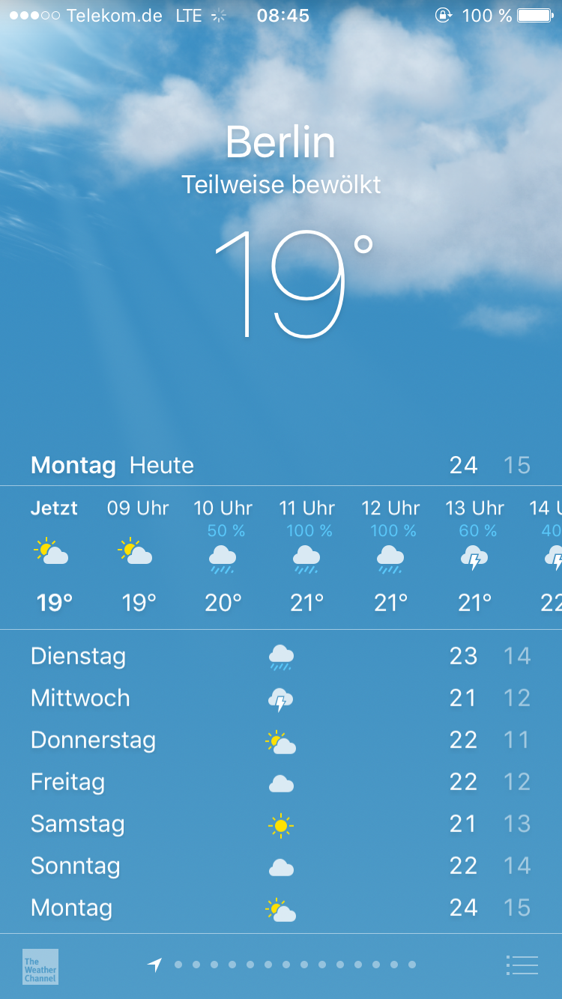

# Angular Tutorial: Weather-App

**This tutorial is not finished, proceed on your own risk!**

In this tutorial we will build a weather-app as you might find it on your phone, displaying current data and
forecasts for one city and allowing you to switch between different cities to get this information. 

This tutorial will be added to and amended as we go along.

For now proceed to [the first step](./steps/001-project-best-practices.md)