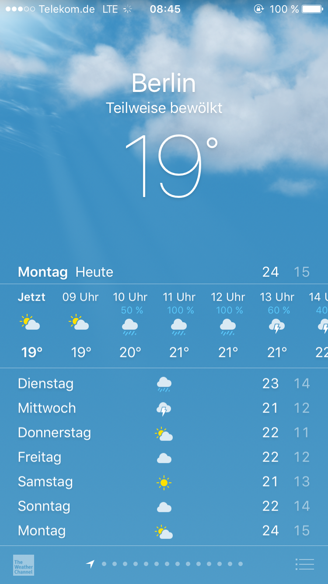
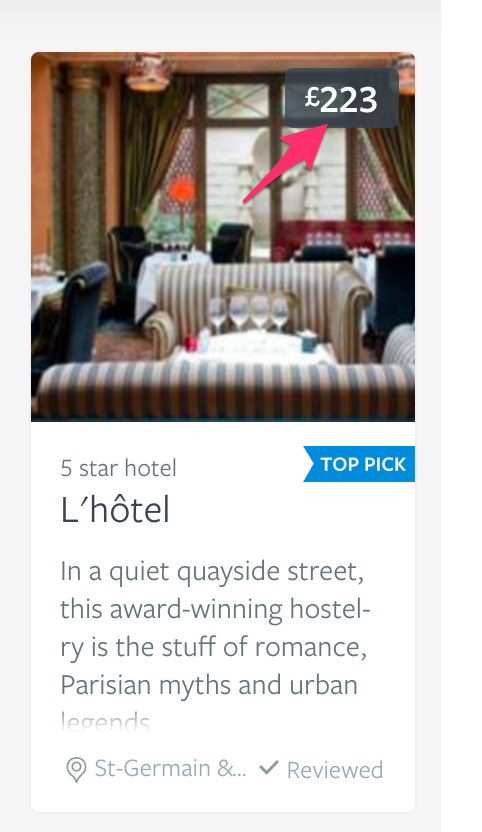

## Design in Frontend-Development
@(Programming)

It is said that there are two types of front-end-engineers: Javascript-Developers and Designers. While the craft of the 
first group is very much that of the traditional Software-Engineer whose favorite programming language happens to be
Javascript, the second group usually has a much deeper understanding of screen design, information architecture, usability, accessability and user experience design. Even though many people just associate the word "design" with the visual  representation of something, in reality all the mentioned aspects are very important in getting people to actually care
about your product and enjoy using it.  

If you are in luck you might find yourself in a work environment where you can just be a javascript developer and have other professionals such as designers, product owners and  user-experience-professionals who take care of actually crafting the product for you. In an ideal world you will be  presented with a prototype of the final product, which uses static data and might be written with much simpler tools than you intended, but not only shows you how it is supposed to look on all kinds of devices, but also how all the user-flows are supposed to work and how the UI is supposed to handle interactions. 

In reality you are likely never going to be this lucky and find yourself confronted with the expectation to be able to solve
or at least make recommendations about all design related issues that can come up in creating user-interfaces. This might seem like quite a challenge because design is one of the areas where everyone feels competent themselves but hardly anyone really is. This largely stems from the fallacy that we believe ourselves to be just like our users. In reality the user's expectations, taste, abilities and thought-processes are guaranteed to be different from our own. Also design, just like tennis, cannot be taught through reading texts, but must be practiced in order to get any serious kind of understanding about it. So you should do so by always being curious about new products and following design and ux-related discussions online. But when in doubt and there is a dedicated UX-Designer on the project, defer to his decisions. 

You will most typically find yourself in a situation where some kind of static design (usually optimized for a very large computer screen) is delivered with the user story, usually in form of a screenshot or some PDF file. The shortcoming of this kind of deliverable is that it does not tell you anything about the dynamic nature of the medium we are designing for. It is therefore vital to ask a lot of questions during the preparation of the story and also know how you can help yourself if you cannot get the questions answered. The screenshot we have so far delivered with this tutorial is a good example of a bad deliverable for a story: 

The above screenshot might look complete but in any kind of real situation you should reject any story that just
contains this as information. The following information is missing:

* Typefaces, font-variants, font-sizes about all text visible on screen
* Color codes
* No information about how elements are supposed to be spaced (absolute or relative values, or design systems such as grids)
* It is clear that some elements are intended to be interacted with, but it is unclear what is supposed to happen when you do
* It is quite obvious that this is the design for a mobile phone in portrait mode. How is the same screen supposed to look
    at other resolutions on other screens, such as landscape orientation, smaller mobile phones, large desktop screens at
    different resolutions. 
* If the displayed data is supposed to be retrieved from an external server, how are loading and error states supposed
    to look?

With some practice you can infer some of these information from the screenshot:
* You can use a color picker to get the color codes, but be aware that this is unreliable, due to anti-aliasing, missing
    the right spot, wrong color profiles or image-compression-algorithms. You might get close, but always get a specification 
    if you can.
* With some practice you can probably guess the used typefaces and the font size,
    but it is still very easy to be wrong (really trust yourself to spot the difference between "Helvetica" and "Helvetica Neue"?)
* You might even guess some of the intended interactions, but as described above, you might guess very wrong if your
    client has different expectations and you might do a lot of unnecessary work if you do not get all the information 
    beforehand.

### Approach

When presented with any kind of static design, start by breaking it down into individual components. Actually
knowing how to do this, is a process that you will only master with experience, but one mental model that can be helpful
is [Atomic Design](http://bradfrost.com/blog/post/atomic-web-design/) pioneered by Brad Frost. Its basic distinction
is between "Atoms", "Molecules" and "Organisms". An Atom is the most basic building block of a component, for example 
a single text style or one specific icon. A molecule is a bigger reusable building block that is made up out of atoms,
eg. a text input field with its label. An organism is made out of multiple molecules which together form a reusable
UI-element that might be used on a lot of different pages, like a Header. 

Lets try to illustrate this, with this example of a molecule used on the Lonely Planet Webpage:

*Source*: http://rizzo.lonelyplanet.com/styleguide/ui-components/cards (Take a look to see what well designed
styleguide for webpage might look like)

This is called a "card", a quite popular design element in current webpages, first popularized by Pinterest. 
The whole card is an "organism", a design element that can be filled with variable content, and reused throughout 
the page. For example on a page that combines them into a grid of these cards to present
you with a selection of recommended hotels as in this example. 

The organism is made up out of several molecules, which in turn consist of different atoms. We can see 
this in the highlighted price tag, which is a molecule consisting of three different atoms:

1. The text style for the price ("223")
2. The text style for the currency symbol ("£")
3. The transparent background with rounded corners

Many more molecules exist in the provided card component and you can try to identifiy them as an excercise. The expectation 
in this approach is that you define any of these atoms as components just once and then reuse them to make up 
more complex components. This will lead to many very small components, with very limited scope, this is on purpose.

"Atomic Design" is just one mental model you can employ to start breaking down the design 
delivered to you. Many more exist and you should familiarize yourself with any way of thinking about them you come 
across and then find what works best for you. Breaking down the screen into a system in this way, will also help others 
to remain consistent and you should avoid multiple implementations for the same visual representation if you can. 
Remind the designer that he also has to stay consistent, he usually wants the same thing.

Once you have broken down a screen in this way, many questions will arise of how these elements are really supposed to 
look and clear information should be provided by the designer. Below you will find an incomplete set of questions that 
can help you with the information you should have before you start developing anything.

### Questions

#### Platform: Who is the product for?

These are questions that usually need to be answered before starting a new project and should **not** change once you start, 
because any change to your assumptions will be costly and painful – a fact you should communicate very clearly to your
stakeholders.

##### Screen

* What are the targeted devices/screen resolutions? 
* What browsers need to be supported in what versions on which operating systems? You should try to support all of them when you can, but it is unrealistic to test on all of them, so settle on a set of devices that if the tests pass make the feature ready for production.
* What is the most typical device you expect your target audience to access your product with?
* Are there any planned interactions that only work or do not work well on a touch device?

##### SEO
* How important is Search Engine Optimization for this product? This might influence your choice of technology, 
    because if it is very important you will need to set up Server Side Rendering or a similar technique for your 
    front-end-application
* Does the content need to be structured in a certain way?
* Do we need to employ special markup for targeted platforms, eg. [Open Graph Tags for Facebook](https://davidwalsh.name/facebook-meta-tags). 
    Other forms of special markup exist for Twitter, Google Plus, Google Search, Pinterest, etc.
* Do we need to support any proprietary content access technology like Facebook Instant or Google AMP?
* Are there special requirements for titles and meta-tags, where do we get this data from? How do we need to manage it?

General rule: Try to do as little as possible here, because these things are hard to debug and costly to support and keep 
running. Challenge every decision of product management in this area. Try to get them to agree to numbers and methodologies
you can use to track the impact of these measures, so you weigh the success against the costs. Especially SEO is of 
dubious value beyond the basic measures that are also recommended by the search engine providers. But if they can show
you measurable value be enthusiastic about these measures, in the end it is about the user. 

##### Performance
* What is the target for initial load and bootstrap time (user can interact) of the application? On what connections and 
    devices? (Several numbers for different types of devices, eg. mobile, table, desktop might be agreed upon)
* How do we track and evaluate these numbers?
* What are expected reaction times of the interface after a user interaction? This can be interesting for highly 
    interactive applications where the user for example can interact with a diagram that is supposed to redraw itself q
    uickly and smoothly once he interacts.
* Is scroll-performance going to be relevant? (The target is always at least 60fps, but how important is it for this 
    project? Why?)
* Do we rely on special technologies which are not supported yet by all devices and browser we need to support, what 
    fallbacks will we provide? (Some people still deactivate Javascript, block ads, block tracking scripts, webfonts...)
* Does the app still need to work when we are offline?

General rule: The page should load in under 1 second on fast connection types. Pay a lot of attention if your targeted
market is not a western one, connection speeds and typical devices in Asia and Africa are radically less performant than
what you might be used too.

##### Internationalization (I18n)
* Do we need to support more than one language? This is extremely painful to implement after the fact. 
* Is the design flexible enough to support varying text lengths for different languages?
* Do our webfonts support all the special characters that might be required for different languages?

#### Layout: What should it look like

##### Typography
* Are all font styles within the design specified: What typefaces? In what styles (normal, italic, condensed,
    expanded)? In what weights (there is more than just bold)? In what sizes?
* Is the line-height defined?  
* Are the font-size and line-height supposed to be responsive and adapt to the screen size (they should for pages
    that are primarily text-based, like blog posts, articles, ...)?
* Is there a defined hierarchy of headlines (if not, are you sure you wont need them)?
* Is the maximum paragraph-width defined (you do not want to have long lines)?
* Are there special kerning (spacing between chars) requirements (usually only for headlines)?
* Do you want hyphenation? Have you made sure that you are happy with the layout if we cannot support it
    across all browsers/devices?
* Is there a font-stack of fallback-fonts if the chosen font is not available on the system (e.g. because the user has 
    blocked loading of fonts)? Are you still happy with the look if the main webfont is not available? 
* Has all necessary copy be delivered in its final form?
* Have all elements be identified that can contain text of arbitrary length or can be empty. Are there design decision
    about what happens if the text overflows the container, eg. showing an ellipsis (…)

##### Colors
* Has a consistent color stack been defined? Classic ones are brand colors, informative colors,
    like highlight colors, success and failure colors. There might be different shades depending on the 
    backgrounds they are used on (colors look different on light or dark backgrounds). Has this been thought through?
* If you use color to convey information, have you made sure that it still works if people with vision 
    impairments (presbyopia, protanopia, deuteranomaly, ...) use your app?
* Has design settled on a varied but fixed set of greys they are sure they want to use in all their future 
    designs? 
* Are all drop shadows defined (offset, blur, etc.)? There are usually four kinds: A subtle shadow to highlight
    interactive elements, a more pronounced shadow to add a hover-effect, a strong shadow to give perspective to 
    dropdowns and similar elements, a distant shadow for modal components.
* Is there a definition for the text highlight-color?
 
##### Assets
* Have all webfonts been delivered in all formats you need for the supported set of browsers? Do you have the 
    necessary licenses to use them? (You can generate web-font-formats from each other, but most web-fonts you can buy,
    have special optimizations for letter-spacing, etc. that cannot be calculated)
* Have all Icons been delivered in SVG, which is the only format you should use today? Have you made sure that
    all browsers you need to support, can use SVG? 
* Have you decided on a system to deal with icons in your project (sprite-maps, icon-font, etc.)?
* Have all images been delivered in a resolution large enough to support your largest device without scaling up?
* Have a you settled on an approach for responsive images? Is it acceptable to your stakeholders?
* Have alt- and title-texts been defined for all images?
* Is there a favicon and/or app-icon?

##### Dimensions
* Is there a grid-system that is the foundation of all design? If no, why the hell not? If they need inspiration
    here is a [personal favorite](https://spec.fm/specifics/8-pt-grid)
* What are the sizes of all the elements on screen and their relations to each other and internally (margin and padding)? 
    These should be derived from your chosen grid system.
* What is the responsive behavior of your app? Are there breakpoints where you want to remove or add content to 
    the screen (the basic idea of mobile-first-approaches was to find a good design for all the elements you want to
    show on a small screen, because it is easier to add things)? Are those breakpoints a good fit for the devices you
    want to support?
* Do you have a good strategy of how you add content to the page when the user changes screen size? What if he
    starts on a small size and then maximizes the window, are you still showing everything you want?
* Have you settled on a set of units for all measurements (px, em, rem, vw, vh, vmax, vmin, fr ... not pts, not picas plz)? 
* Do you have a set of consistent border radiuses you want to use for all elements? There are usually at least three (one 
    for tiny elements, one for medium sized elements and one for large elements)

##### Misc
* Do you want Tooltips: Are the ones built into the browser via title-tags enough?
* Loading-, Error-, Empty- and Reduced-States: The content your app displays... 
    * ...might not be there yet (loading)
    * ...it might never or only partially arrive (error)
    * ...there might be no content yet, because of lack of user interaction (empty)
    * ...there might be less content than the designer imagined in his designs 
        (e.g a blog post with very little text, no images, no links, etc...). 
    Do the designs handle these states gracefully, have you used it to your advantage (onboarding, feedback)?
* Not-Supported-State: Do not present the users that might have a browser or technology you do not support with a broken
    page. Redirect them to a "browse-happy"-page, that tells them how they can get hold of a newer browser that supports the
    page. [Example](http://browsehappy.com/?locale=de_de)
* Modals, Notifications: Most websites will need some design for displaying notifications or dialogs to the user. 
    Is this planned, do designs exist? 
* Print Styles: Is it feasible that the user might want to print a page. If so, are there designs for a print stylesheet?
* 404- & 500-Pages: 404- and 500-Pages indicate that some URI is unknown or the server is in a temporary error-state.
    What do you want to show to the user in these cases?

#### Interactions
* Tap-Animation: On touch screens it might be a good idea to show to the user with an animation where his last tap occurred.
* Buttons: 
    * Standard: Usually included in designs
    * Hover: Buttons should always have a hover-state to signal to the user that they can be interacted with 
    * Disabled: Buttons might have a disabled-state if they cannot be clicked until some condition is true or to
        signal that they have already been interacted with
    * Progress: Buttons might have a disabled-progress-state that indicates that some operation is currently underway
        and they cannot be interacted with until it finishes
    * Focus: A button can be focused with the keyboard, a focus-indicator should be displayed - usually some kind of 
        outline  
* Loading-Indicator / Progress-Bars: These are elements that indicate to the user some operation needs to finish 
    before the user can interact again with the UI. A progress-bar should convey a realisitic impression to the user
    how much longer the wait might be (or not pretend to be one of those, there are indeterminate progress-bars). 
    These elements are usually animated, what should the animation look like?
* Animations: Animations usually want to draw the attention of the user to some changes on the screen or provide a 
    clearer feedback that the application has registered the user interaction. Are these designed and consitently used?
* Keyboard-Navigation: Your whole application should be usable without ever touching the mouse (on desktop devices). 
    Has this been addressed?
* Links:
    * Standard: Usually included in designs
    * Hover: The mouse is right on top of the link, indicating that it can be clicked. Can be animated.
    * Active: The user has clicked on the link but not yet released the mouse-botton
    * Visited: A special style that indicates that the user has been on the page targeted by the link before (do not omit this one)
    * Focus: Similar to hover but for keyboard-navigation, the element has been activated with the keyboard and is the
        element that will receive all further keyboard inputs
* Tables: Tables are elements that are well known to the user and they usually do have some expectations, about what 
    they can do with them. At minimum they might expect highlighting the row that is currently under the mouse
    cursor, but additional interactions like sorting or rearranging the columns might exist. Has this been evaluated 
    and designed?
* Charts: Charts usually visualize complex data-sets that offer various opportunities for interactions. You might wish to
    for example isolate specific information when the user hovers over some part to ensure better orientation, more complex
    interactions are easily imaginable. Is this planned? Has it been designed?
* Dropdowns, Modals & Tabs: These UI-elements have a deep legacy in desktop-applictions and the user has expectations 
    how he can interact with them. Your UI-elmenets should meet these expectations, eg. keyboard-navigation should work for 
    tabbed interfaces, and dropdowns. Click off-target and ESC should close the modal and the dropdown. Have all these
    interactions been thought about and specified?
* Audio & Video: Users have expectations about how they can interact with audio and video-controls that stem to some 
    part from the interfaces of their old VCR or Stereo, and in part from a by now rich history of good examples on very
    popular sites. Are all the most obvious expectations like volume-control, pause, skip, seek, mute met. 
    Keyboard navigation should work here too.
* Behavior on Scrolling: Is there any behaviour that should occur on scrolling that might be hinted at in the layouts? 
    Examples include lazy-loading new elements or elements that should remain fixed on scroll.
* Special Keyboard-Interaction: Are their any special keyboard-interactions that the user might expect from other
    applications that might be quick and easy to implement, like Meta-F for focusing the search-field.
* Time-Based: Are there any actions that are supposed to occur after a fixed amount of time, like a message that is 
    supposed to be displayed after the user is inactive for a while and offers help. 
* Realtime / Server-Push: Do we want to react when the server updates to a newer version then what is currently displayed
    on the client? The most simple example is in a news-site that has new articles and displays a modal that asks if you
    wish to reload.

If you can identify common ui-patterns in the provided deliverables, challenge them against the the considerations in
well-known ui-pattern-collections:

* eg. for cards http://ui-patterns.com/patterns/cards 
* https://bradfrost.github.io/this-is-responsive/patterns.html

#### Forms: Data input
Whenever the user is supposed to enter data, forms are involved. Most tasks the user performs this way are tedious, so
it is crucial to get this right.
* Input States:
    * Standard: Again the most obvious state, but might be complex if the input is special, like a date-picker or a file-upload.
    * Disabled: A form-field might not be active if the information cannot be entered after some other condition is 
        fulfilled. Has a disabled-state for all used form elements been defined?
    * Active: The currently active form-field should be highlighted in some way.
    * Error-State: If the data the user entered into field does not pass validation that fact should be highlighted.
        Is there a design for that?
* Error-Messages: Error-Messages for all errors should be clear and easily digestable for all segments of your target
    audience. They should, if possible, contain information how the user can fix the error himself or in what time frame
    he can expect the problem to be resolved.
* Error-Display-Behaviour: Is there a specification how and when the data is supposed to be validated and the result 
    displayed to the user? E.g. on entering the data, on leaving the field, on submit to the backend. As a general
    rule validate as soon as possible without being annoying.
* Special formatting: Can the information displayed in the field be formatted to ease reading, 
    eg. phone-numbers or IBAN-numbers.
* Auto-Save: The user should never ever lose data, you should have some mechanism to save incomplete form-data before
    he submits especially when the form is rather long. You can either try to do this in the backend or employ some 
    kind of local storage mechanism. Another approach might be that you keep the individual steps of data-entry 
    extremely short (as short as just asking one information at a time), so worst-case the user only loses very little data.
* Validation: Make sure that the validation has been specified in a way that is more kind to the user than the systems,
    whatever information you can derive safely from what the user has entered should be derived. For example do not force the
    user to specify a date in a certain way but try to derive the storage format from whatever the user entered if you can.
    The general idea is to support the user and not boss him around.
* Labels / Placeholders & Contextual Help: Almost every form field should have a label and a placeholder. A label is meant to
    say what information needs to be entered into the field. A placeholder is supposed to give information on how that
    information is meant to be entered or explain what kind of information is exactly needed. Contextual Help is the
    more verbose form of a placeholder, where you want to explain something in so much detail that it would take
    so much space on the screen, that you only want to display it when needed.
* Additional input-methods: Consider if you can make entering the data more convenient for the user and if popular
    input methods are possible. For example with drag & drop for a file-upload, paste for a password-field, 
    direct-recording for a video or picture, direct integration in popular password-managers, etc.
* Keyboard Navigation: The user should be able to tab through your form in a natural flow of how the elements are
    displayed on the screen
* Submitting: Has the behaviour after the user presses submit been adressed? The form should be displayed in a disabled
    state to indicate that no further interaction is possible and some kind of progress indication should be displayed.
    If the backend reports errors it should be clear where and how they are supposed to be displayed

#### Meta-Information: What goes into the head
Whenever doing a new page just do a quick check, if there are any additional requirements for the meta-information 
of the page, for example:
* Title
* Meta-Tags
* References to any feeds
* Canonical URLs
* Whatever speciality might lie within the problem-domain of the current page

#### Side Effects
* Analytics: What user actions are supposed to be tracked? What information shall be derived from that? Is there a 
    design for the mandatory cookie-notice?
* Logging: Is there any special logging that should be performed in the backend or in the browser console to ease debugging,
    e.g. special performance tracking how long the backend tasks for this interactions took?

#### Assistive Technologies
* Are there any special requirements for this feature with regard to accessability that might impact how we right
    our markup or solve the problems presented to us?

### A Checklist

The instances when you start a project completely from scratch will probably be quite rare in your professional life.
Here is an abbreviated checklist for stories that intend to implement new features, you can use in groomings:

* If there are new elements (not variations on existing ones):
    * Do you know how to break them down into atoms or primitives of the design systems, like existing text-styles,
        buttons, etc. If you cannot not and a new style is introduced is there a good reason for this?
    * Imagine all possible states this element can have are they defined, eg. (do not apply for all elements):
        * Standard
        * Hover: Styles, Tooltip
        * Active
        * Focus
        * Visited
        * Error
        * Disabled
        * Empty
        * Overflow: What should happen if there is too much content for the element to visually contain it or are
            you sure that that can nerver happen
        * Responsive: States on other resolutions or devices
    * Does any state of the element have additional visual impact, eg. an error-state of an input element, can trigger
        the display of an error message?
    * Are all required assets & copy provided in the necessary formats?
    * Does the element involve communication with other services or components, does this introduce new
        new loading- and error-states, do we have existing mechanisms for that?
    * Visualize the intended interaction flow of the user with that new UI-Element:
        * Does this element at any stage of its interaction introduce new interplay with existing elements, is
            this defined, eg. a new form element is introduced, does it interact in any way with the existing ones
        * Are there additional ways the user might be accustomed to interact with the new element, eg. tabbing, close with ESC, navigating with the arrow keys. Is this adressed?
        * Is there anything missing within the flow, like additional notifications or steps to the user, you might want
            to challenge?
        * Are you clear on how within the user-flow the user transitions in and out of the element?
    * Is this supposed to be tracked or monitored in some way (Interaction, Performance, KPI, Logging)?

* If there are only variations on existing elements:
    * Is the new element really new or do we have an existing one that already has most of its functionality and
        should be used/can it be extended?
    * Where is the existing element used, does this have an impact on other screens or flows that might not have been
        addressed?
    * Does the existing component fulfill all the points for new components?
    
If you have answers to all these questions you can be reasonably sure that you can start the story. 