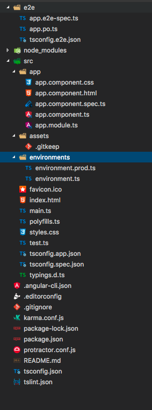

# Project Setup

The first step of any new project is to setup the project with all the tools a modern development approach offers
to have a solid basis to develop, quality-check and rest our frontend. This is a task which traditionally in 
frontend-development could be quite cumbersome because for each part a lot of different options existed. 

Nowadays things have improved and most modern frontend-framework offer some kind of CLI-tool that makes bootstrapping
a simple project very easy, as it provides you with a selection of tools and configuration that are usually curated 
by the development team of the framework. Examples of CLI-tools include [`create-react-app`](https://github.com/facebookincubator/create-react-app)
for React, [vue-cli](https://github.com/vuejs/vue-cli) for VueJS and the one we will use for our project [angular-cli](https://github.com/angular/angular-cli).

For this step of our tutorial we will use `angular-cli` for the initial setup of our project. Then we are going to 
have a look of the tools and configuration it provides for us under the hood. This can be quite significant as the 
ease of having all that initial project setup taken care for you, can come with the trade-off that you cannot 
configure everything to your liking. This will probably also prevent you to use any arbitrary tool you read about online.

## Bootstrap your project with ng-cli

1. Install ng-cli: `$ npm install -g @angular/cli`
2. Bootstrap a new project: `$ ng new weather-app`. It will create a new folder for you and provide you with some 
basic project setup

## What is provided?

Lets take a moment to examine all the different files and folders that have been created:

`./e2e/*` - This is where all End-2-End-Tests are supposed to go. Similar to AngularJS, Angular uses Protractor for UI-Testing. E2E-Tests are an important part of your overall test-concept and should be significantly less numerous than your Unit-Tests, because they tend to be a lot slower than unit-tests, which does not make them well suited for test-driven-development. This concept is referred to as the test-pyramid and was pioneered by Martin Fowler. More information: https://martinfowler.com/bliki/TestPyramid.html

`./e2e/tsconfig.e2e.json` - This is a custom configuration for the typescript-compiler for the protractor test-files. This is due to the fact that we want to write the test themselves in typescript, but the protractor-test-runner cannot work with typescript-files by itself. This means that all tests that are written in typescript must be converted to javascript-files before protractor can execute them.

`./e2e/app.po.ts` - This is a "Page-Object"-file, hence the suffix `po`. It is a common pattern to structure your E2E- or Selenium-Tests in "Page Objects" and the actual test-files. The idea behind this pattern is that you separate the code that actually asserts the UI against the expected values and the code that extracts the test subjects from the page. Take a look at the files for an example of this approach. The idea behind this is that the extraction of the test-subjects from the page depends on the API of the testing framework you use (in this case Selenium/Protractor), while the code actually asserting that the values are as expected depends on the assertion library (in this case Jasmine). Separating the two allows you to switch out one without having to touch the other. You would add more Page Object-Files as you add more routes you want to test. You can read more about this approach here: http://www.protractortest.org/#/page-objects

`./e2e/app.e2e-spec.ts` - This file contains the actual assertions you want to run within the UI. As you can see it imports and uses the Page Object-files to get its test-subjects.

`./node_modules` - This is the standard-folder all the dependencies specified in `package.json` will be installed into.

`./src` - This folder contains all your application-code, plus all configs and assets that are needed at runtime

`.angular-cli.json` - This is the configuration for the `angular-cli`-tool. The official documentation for this file is very thin. Accept it as given for now.

`.editorconfig` - This small file is very important to ensure that all members of a project-team use the same configuration when it comes to the configuration of their IDEs. It defines for example if a press on the TAB-key creates tabs or spaces and how many spaces an indent is. Your IDE needs to support these files and with some IDEs you might need a plugin.

`.gitignore` - This is a config file for the Git-VCS. It defines files or patterns which git is supposed to ignore. Take a look at it to see what kind of files that might include. It is usually temp-folders, temp-files, IDE-meta-information, caches, etc.

`karma.conf.js` - Karma is the Test-Runner Angular uses. It is basically a tool that takes the files of your test-frameworks, your test-subjects and the files containing your tests into a browser of your choice and lets the browser execute the tests. This file contains the configuration for the test-runner.

`package-lock.json` - This file represents a pretty recent addition to the npm-ecosystem, it holds all the resolved dependencies of your project and all their resolved dependencies. It is supposed to be committed to VCS alongside all other files and guarantees that the installation of all dependencies will be deterministic in other environments. If you want to read more about this file: https://docs.npmjs.com/files/package-lock.json

`package.json` - This is the main-file that describes your project to npm. It contains your dependencies, custom scripts, some descriptions and a bit of additional documentation.

`README.md` - The main documentation-file

`tsconfig.json` - This is the main config-file for the typescript-compiler. It is a dependency for some other `tsconfig.json`-files in other directories. If you want to know more about the structure of a tsconfig-file: https://www.typescriptlang.org/docs/handbook/tsconfig-json.html

`tslint.json` - This is file defines the rules that are used by `tslint` when enforcing the code quality guidelines of this project. You can see at the top of the file that another config is imported from a npm-package (named codelyzer). You can get an overview of what all of the individual tslint rules do here: https://palantir.github.io/tslint/rules/

## What is hidden?

This might already seem like a lot of visible tools and configuration, but alas it is only the tip of the iceberg as the config for the most important tool is hidden deep in the dependencies of `angular-cli` itself.

