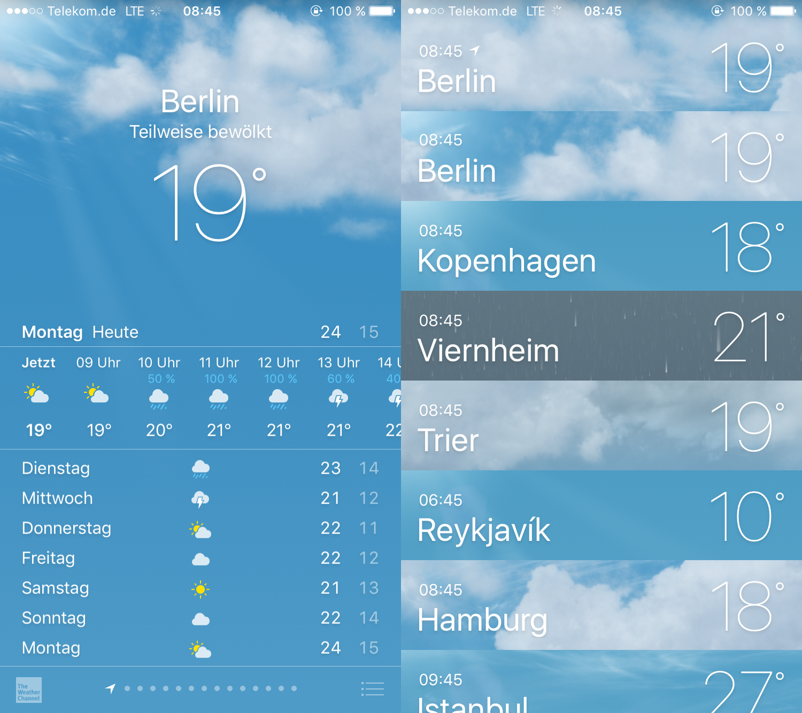
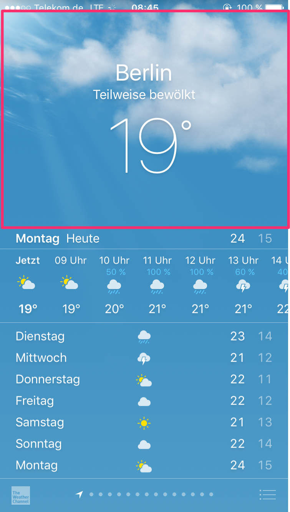
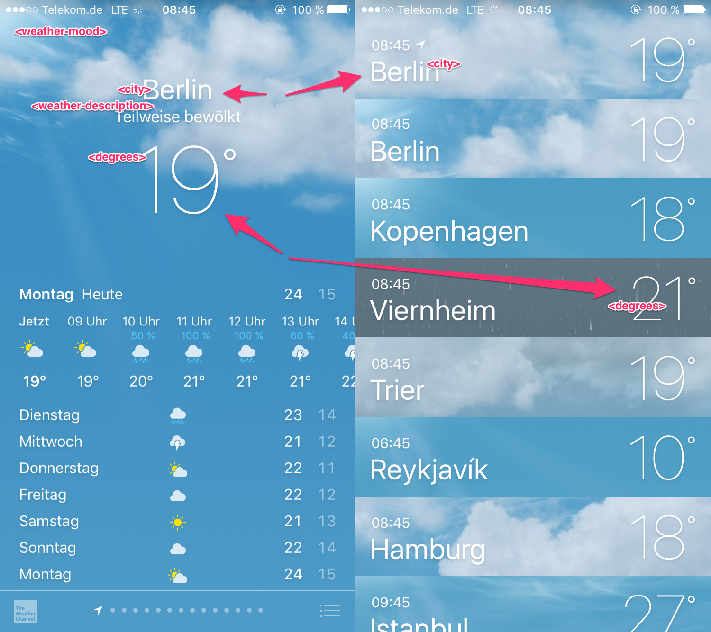

# Getting Started

So we now have a project setup that should be suitable for our purposes. If you have not already done so, 
revert the ejection of the app to its prior state. 

So lets have a look at what we want to build:

In every development work you do no matter if backend or frontend you will begin by conceptually breaking down the app
and your work into smaller parts. This serves the purpose to make the work better organizable and that is what you would
do in groomings and sprint-plannings. But usually you will also find a structure that will be the organizing principle 
of your code. It will aso help you in not repeating yourself as you identify components that appear in more than one place
and which you should implement only once.

Think for a moment about how you would structure an app like this.

In frontend development you usually have some form of visual design, when you start developing a new app. You can use 
this to break this app down in smaller parts or if you do have a really good product owner he might have already done that
for you. In this design one global distinction between its parts is clearly visible as you can see that you have
different screens:

* One on the left which shows you the weather information for a single city, in this case Berlin
* One that is a list of cities just showing the name of the city, the current local time and the current temperature

Between the two screens absolutely no visible elements are in the same place and this is a good indicator that they
are different "pages" and in web development this usually means that they would be accessible under separate urls.

Lets start with the top of the left screen: 

The basic building blocks of modern frontend-development are "components". A component
is a part of a user interface that you can potentially use in more than one place. Whenever you can reuse a component
you increase your changes for greater consistency in your screens. If you want to know more about them,
you can read a good introduction here: https://derickbailey.com/2015/08/26/building-a-component-based-web-ui-with-modern-javascript-frameworks/

Possible components for this part of the app are:

* `<weather-mood>`: The background displaying a fullscreen impression of the current weather situation (might be animated)
* `<city>`: The text "Berlin"
* `<weather-description>`: The text "Teilweise bewölkt"
* `<degrees>`: The text "19°"
* `<weather-shortinfo>`: The combination of <city>, <weather-description> and <degrees>

We can also identify how these components might be reused in the future:

The last component highlights another very important concepts: composability. Just like traditional HTML-Tags you can
nest components into each other and create new components. This allows a very granular approach to structuring your
frontend-apps and different levels of reusability. The `<city>`-component might be highly reusable, because in 
essence she represents just a very particular way of formatting a text (3rem Helvetica Neue light in a white color
and with a drop shadow), while the `weather-shortinfo`-component might potentially only exist in one place within your
app. 

**Task**

* Build the five components mentioned above and make them display the current temperature and weather in Berlin

**How to do it**

* You will need an API to get the weather data. We will use https://openweathermap.org/api. 
You are going to need an API key, so sign up for one http://openweathermap.org/appid
* All the data you need is provided by this endpoint: https://openweathermap.org/current
* Build a service that has a method for requesting and storing the weather for a single city from the API.
* Build the components mentioned above and style them for now to look like the screen as closely as possible. For the
`<weather-mood>`-component you can look for some nice pictures from https://unsplash.com/
