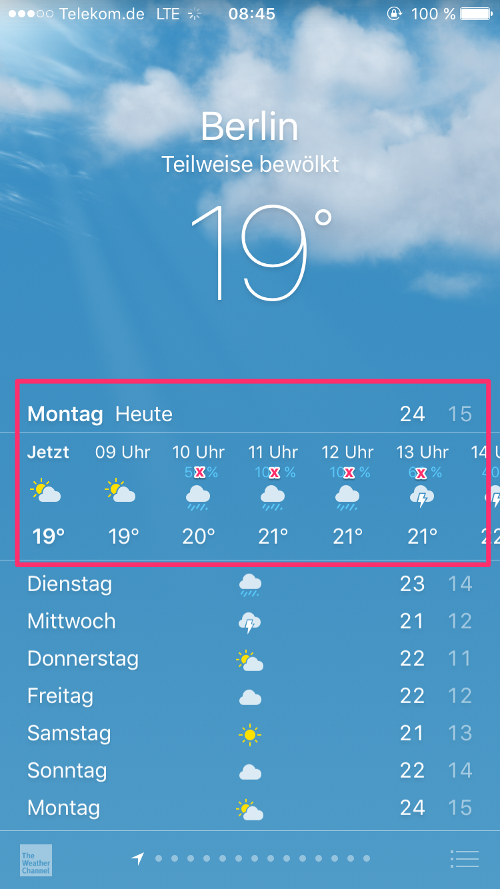

# Feature: Forecast for the current day

The next few components we want to build are the display of the current day of the week, with the minimum and maximum temperature and an hourly forecast for the current day:



**Task**
* Break this part of the view down into several components and a wrapper that takes care of getting the data from the weather API as we did with the previous parts of the App. Here are a few suggestions:
    * Build a wrapper component that contains the components that display the detailed data for today
    * Build a nested component that display the text "`<current day>` Heute and the minimum and maximum temperature
    * Build a component that holds the time, the weather icon and the temperature, those should be individual components again
    * Build a component that holds all the hourly weather-information and displays them from left to right. If they do not fit make them scrollable.

**How to do it**
* You already have the information for the minimum and maximum temperatures for today from the original call for the current weather information. You will need to add them to the data-object you return from your resource-service
* In the screenshot you can see that an hourly forecast for the current day is provided. The API we are currently using, does not offer this kind of information, but does have an endpoint that provides a three-hourly-forecast: https://openweathermap.org/forecast5. You will need to connect that endpoint and query it for the required data. It is okay that we cannot display hourly forecasts, the three-hour data suffices 
* As we now have start aggregating weather data from a city from more than one API-endpoint, you might want to build another Service that holds the weather data from all endpoints and uses the resource-service you already built to get that data:

    So you would go from this architecture:

```
+-----------------------------+                   +---------------------------------+               +-----------------------+
|                             |                   |                                 |               |                       |
|  WeatherShortinfoComponent  ----------------------      WeatherAPIResource        |----------------   OpenWeatherMapAPI   |
|                             |                   |                                 |               |                       |
+-----------------------------+                   +---------------------------------+               +-----------------------+
```

To this:

```
+-----------------------------+       +-----------------------------+           +---------------------------------+               +-----------------------+
|                             |       |                             |           |                                 |               |                       |
|  WeatherShortinfoComponent  ---------     WeatherDataService      -------------       WeatherAPIResource        |----------------   OpenWeatherMapAPI   |
|                             |       |      (suggested name)       |           |                                 |               |                       |
+-----------------------------+       +-----------------------------+           +---------------------------------+               +-----------------------+
```

* The OpenWeatherMap-API also does not provide us with chance of precipitation so we will leave out that information (marked in the screenshot with an x)
* We also need icons as shown in the screenshots. Our chosen API does provide icons but they are not very attractive. You can replace them with these: http://adamwhitcroft.com/climacons/. Use the svg-files. You can use them in image tags, or as svg is just an xml format use them directly in your html-templates. You can then map the weather-condition-id we already use for the `<weather-mood>`-component to the corresponding icon.
* Do not forget to write tests.

