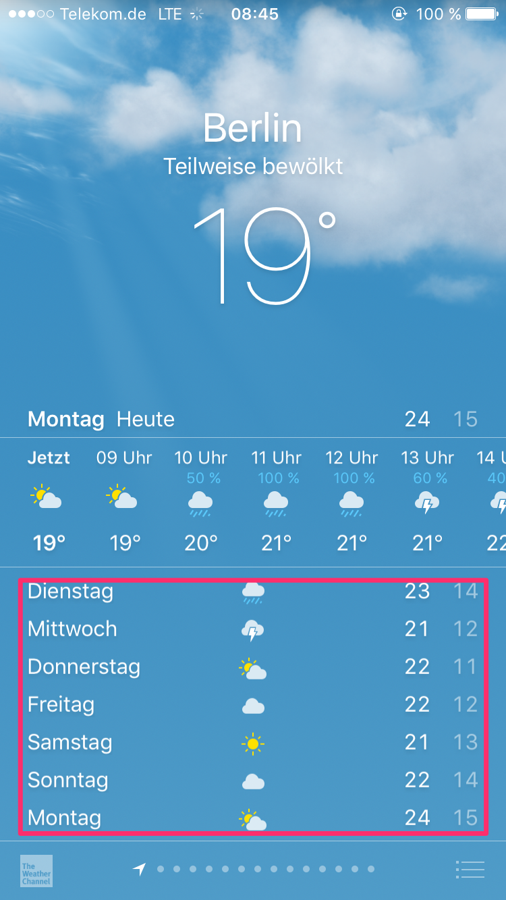
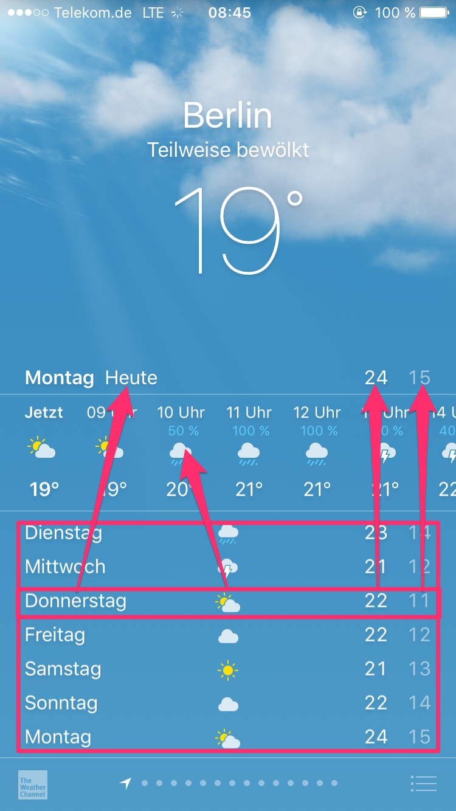

# Feature: Daily forecasts for the rest of the week

Next we want to build the list of daily forecasts for the following days.

Each row consists of:
* The day of the week
* An icon showing the weather situation
* The maximum temperature
* The minimum temperature

We are now in a situation that all the elements which we encounter in a row are reusable from our earlier features,
so we can just create one new component which represents one day (the row) and fill it with components we already
built earlier.

**How to do it**
* We need yet another endpoint from the OpenWeatherMapAPI to get a forecast for the next days: https://openweathermap.org/forecast16.
It contains all the information we need for the next days in an array.
* Write a wrapper-component for one row of weather data and reuse your earlier components as shown above
